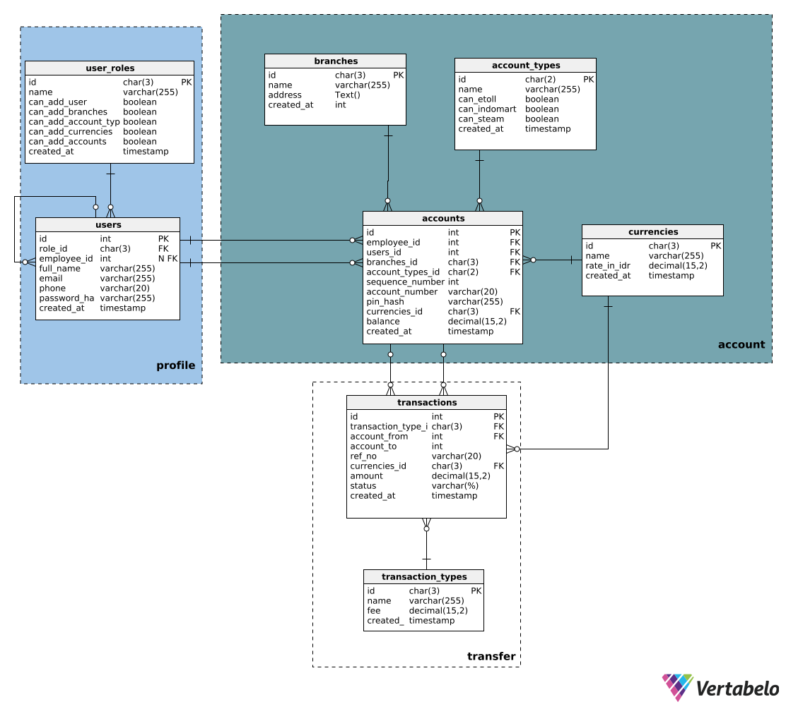

# 🚀 BankAPI - Money Transfer REST API Service : A Portfolio Project
### Tentang
BankAPI adalah RESTful API service untuk pengelolaan user, cabang, akun, mata uang, dan biaya transaksi.
- BankAPI menerapkan Dependency Injection, Domain Driven Design, dan Clean Architecture.
- Proses load configuration dari file `.env` dilakukan didalam `config/*`.
- Manajemen service atau framework yang digunakan dilakukan didalam `service/*`
- Manajemen database, external api, komunikasi protokol lain berada didalam `infrastructure/*`
- Manajemen middleware dilakukan didalam `internal/middleware/*`
- Manajemen utility function dilakukan didalam `internal/utils/*`
- Manajemen error dilakukan dengan membuat custom error type beserta fungsi untuk menentukan kode http status dari error tersebut `internal/utils/errors.go`
### Kelebihan
Dengan penerapan yang telah dilakukan, dapat dilihat bahwa:
- Struktur kode yang modular dan terorganisir memudahkan proses pengembangan, debugging, dan scaling aplikasi.
- Dependency Injection memungkinkan pengujian unit (unit testing) menjadi lebih mudah karena setiap komponen dapat digantikan dengan mock sesuai kebutuhan.
- Clean Architecture menjaga batas tanggung jawab setiap layer (handler, usecase, repository), sehingga logika bisnis tidak tercampur dengan detail implementasi teknis seperti database atau HTTP framework.
- Konfigurasi fleksibel melalui file .env yang memudahkan pengaturan environment tanpa harus mengubah source code.
- Middleware terstruktur memungkinkan penerapan fitur seperti autentikasi JWT secara konsisten dan mudah dikembangkan lebih lanjut (misalnya logging, rate-limiting).
- Custom error handling memberikan kontrol lebih atas response error API agar lebih informatif dan sesuai dengan standar HTTP status code.

### Catatan Tambahan
- Framework yang digunakan adalah Gin Gonic yang dikenal ringan dan cepat untuk membuat REST API.
- Saat ini project ini belum memiliki implementasi DELETE endpoint pada beberapa resource seperti /branches, /account-types, /currencies, dan /accounts, namun struktur dan dependensinya sudah siap jika sewaktu-waktu diperlukan.
- Jika ingin meringankan performa, gunakan pass by reference pada return dari repository dan usecase.

## Belum Diimplementasi
- Proses Transfer belum diimplementasi saat ini. (Soon)  
<br>

**Key:** ACID, ATOMIC, Transactional DB

---
## Database ERD

Terdapat penyesuaian dalam DDL terhadap ERD. Terutama dalam hal generate account number yang memerlukan entitas baru sebagai provider nomor urutan.


---

## 📌 Auth Endpoints (Public)

| Method | Endpoint         | Payload                     | Deskripsi                   |
|--------|------------------|-----------------------------|-----------------------------|
| POST   | `/auth/login`    | `{"username":"val", "username":"val"}`|Login dan mendapatkan token
| POST   | `/auth/refresh`  | Header `Authorization: Bearer <refresh_token>` |Refresh JWT token

---

## 👤 User Endpoints (Private - JWT Required)

| Method | Endpoint             | Payload                   | Deskripsi                 |
|--------|----------------------|---------------------------|---------------------------|
| GET    | `/users/search`      | `{ "username": "val", "nik": "val", "email": "val"}` | Cari user berdasarkan username atau email atau nik
| POST   | `/users`             | `{"nik" : "3522150101010003","full_name": "Achmad Nashruddin Riskynanda","username": "achmad999","email": "achmad.riskynanda01@gmail.com","phone": "6285231236788","password": "user1234"}` | Tambah user baru
| GET    | `/users/:nik`        | | Ambil user berdasarkan NIK

---

## 🏢 Branch Endpoints (Private - JWT Required)

| Method | Endpoint             | Deskripsi                     |
|--------|----------------------|-------------------------------|
| GET    | `/branches`          | Ambil semua cabang            |
| GET    | `/branches/:id`      | Ambil cabang berdasarkan ID   |
| POST   | `/branches`          | Tambah cabang baru            |
| PUT    | `/branches/:id`      | Update data cabang            |
| DELETE | `/branches/:id`      | 💤 *Masih di-comment*          |

---

## 🏦 Account Type Endpoints (Private - JWT Required)

| Method | Endpoint                   | Deskripsi                      |
|--------|----------------------------|--------------------------------|
| GET    | `/account-types`           | Ambil semua jenis akun         |
| GET    | `/account-types/:id`       | Ambil jenis akun berdasarkan ID|
| POST   | `/account-types`           | Tambah jenis akun baru         |
| PUT    | `/account-types/:id`       | Update jenis akun              |
| DELETE | `/account-types/:id`       | 💤 *Masih di-comment*           |

---

## 💱 Currency Endpoints (Private - JWT Required)

| Method | Endpoint           | Deskripsi                        |
|--------|--------------------|----------------------------------|
| GET    | `/currencies`      | Ambil semua mata uang            |
| GET    | `/currencies/:id`  | Ambil mata uang berdasarkan ID   |
| POST   | `/currencies`      | Tambah mata uang baru            |
| PUT    | `/currencies/:id`  | Update data mata uang            |
| DELETE | `/currencies/:id`  | 💤 *Masih di-comment*             |

---

## 📘 Account Endpoints (Private - JWT Required)

| Method | Endpoint                                       | Deskripsi                                      |
|--------|------------------------------------------------|------------------------------------------------|
| GET    | `/accounts`                                    | Ambil semua akun                               |
| GET    | `/accounts/:accnumber`                         | Ambil akun berdasarkan nomor akun              |
| POST   | `/accounts/:branch/:acctype/:nik`              | Tambah akun berdasarkan branch, type, dan NIK  |
| PUT    | `/accounts/:accnumber`                         | Update informasi akun                          |
| DELETE | `/accounts/:id`                                | 💤 *Masih di-comment*                           |

---

## 💸 Transaction Fee Endpoints (Private - JWT Required)

| Method | Endpoint                        | Deskripsi                                |
|--------|----------------------------------|------------------------------------------|
| GET    | `/transaction-fees`             | Ambil semua biaya transaksi              |
| GET    | `/transaction-fees/:id`         | Ambil biaya transaksi berdasarkan ID     |
| POST   | `/transaction-fees`             | Tambah biaya transaksi baru              |
| PUT    | `/transaction-fees/:id`         | Update biaya transaksi                   |
| DELETE | `/transaction-fees/:id`         | Hapus biaya transaksi                    |

---

## 🛠 Cara Menjalankan Project

1. Copy `.env.example` ke `.env`:
   ```bash
   cp .env.example .env
